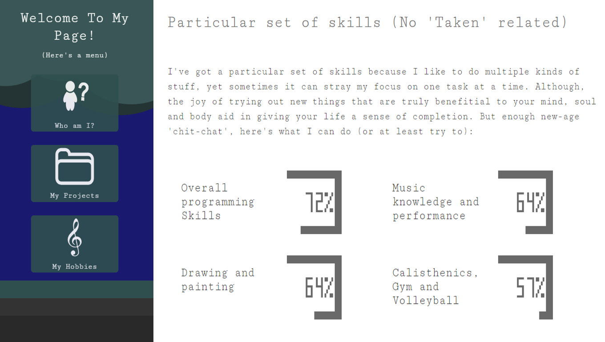

# sfmunera10.github.io
A personal responsive website made for my web development class.

### Main objective
Create a portfolio within a responsive, stylish and functional website while considering technology integration, comparison and a global improvement in programming skills within the front-end development area.

### How to run the site
Just access to this URL with your preferred browser: https://sfmunera10.github.io/

### Authors: 
Santiago Felipe Múnera Dávila 
  Links:
- https://sfmunera10.github.io/
- https://docs.google.com/presentation/d/1V0SyWVR3p4_uv-vOOTBcPOKJAaiqAnw-g7DwL1a6Cp8/edit#slide=id.p
- https://www.youtube.com/watch?v=TkYJbl6uq4A

